# Credit_Risk_Analysis

## Overview of the analysis:
Using the credit card credit dataset from LendingClub, a peer-to-peer lending services company to predict credit risk. Evaluate the performance of different machine  learning models & recommend  whether they should be used to predict the credit risk.

## Results:

### Naive Random Oversampling:

* The balanced accuracy scores
    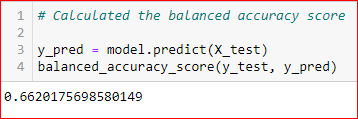
* The confusion matrix
    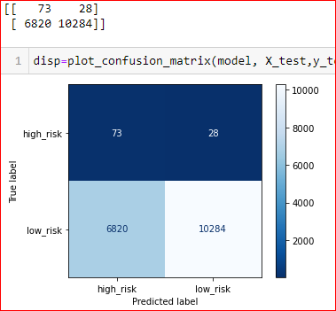
* Classification report
    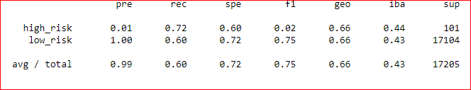

### SMOTE Oversampling:

* The balanced accuracy scores :
    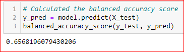

* The confusion matrix
    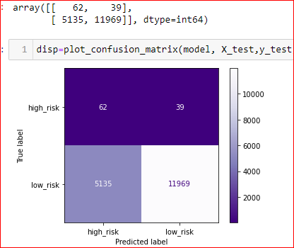

* Classification report
    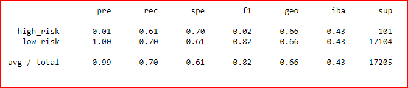

### ClusterCentroids:

* The balanced accuracy scores
    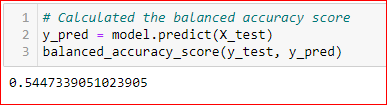
* The confusion matrix
    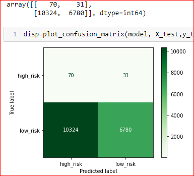

* Classification report
    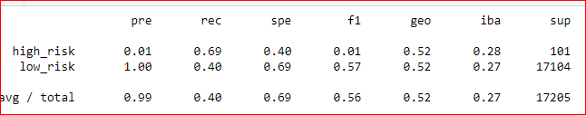
### SMOTEENN:

* The balanced accuracy scores
    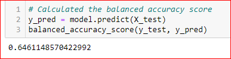
* The confusion matrix
    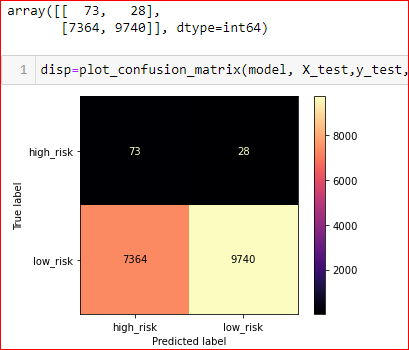
* Classification report
    

### RandomForestClassifier:

* The balanced accuracy scores
    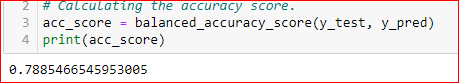
* The confusion matrix
    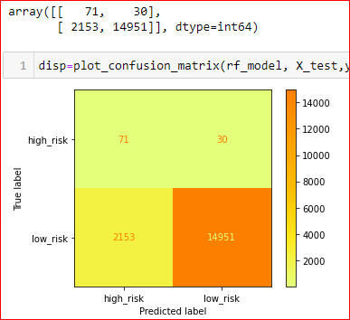
* Classification report
    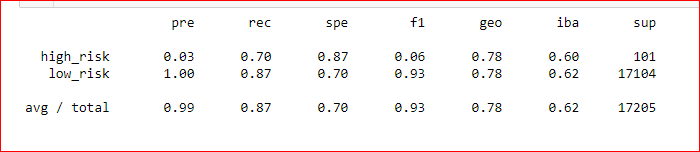

### EasyEnsembleClassifier:

* The balanced accuracy scores
    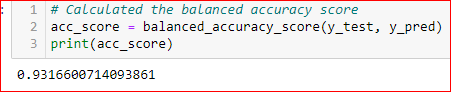
* The confusion matrix
    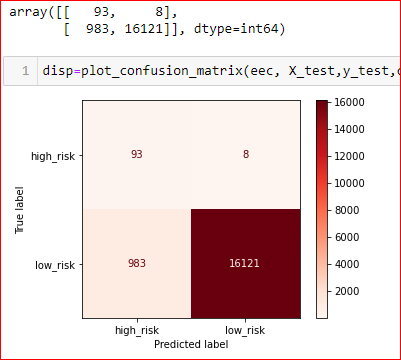
* Classification report
    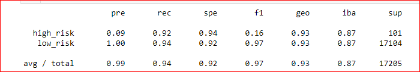

## Summary

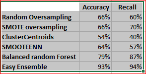

Of the six machine learning models tested, I would recoomend the Easy ensemble as it had 93% accuracy and 94%% recall/sensitivity. The others I will reject as they had 50 to 66% accuracy and recall between 40 to 70%.
